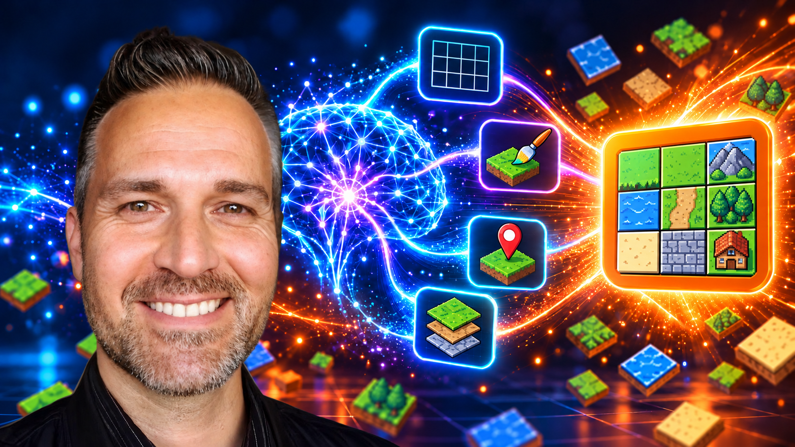

<p>
<br /><br />

</p>

[](LICENSE)
[](skills/)
[](https://www.mapeditor.org/)
[](.codex/INSTALL.md)
[](.claude/INSTALL.md)

# AI Skills Tiled

Create and edit 2D game art, maps, tilesets, terrain, objects, and collision data with twelve reusable [Tiled](https://www.mapeditor.org/) skills. Authoring sources live in [skills/](skills/). Generated client packages live in [.codex/](.codex/INSTALL.md) and [.claude/](.claude/INSTALL.md).

> [!IMPORTANT]
> Skills that edit an open Tiled document use the existing [rpgjs/tiled-ai](https://github.com/rpgjs/tiled-ai) MCP bridge. Art generation works without an editor connection. This repository contains skills, examples, and documentation; it does not contain or replace that bridge.

## Images

The thumbnail above adapts the visual composition of [AI Skills Blender](https://github.com/SamuelAsherRivello/ai-skills-blender) for 2D level design. See the [marketing asset notes](documentation/marketing/README.md).

### Example

<a href="documentation/examples/starter-map/README.md"></a>

## Table of Contents

1. [Getting Started](#getting-started)
2. [Use Skills](#use-skills)
3. [Project Details](#project-details)
4. [Contributions](#contributions)
5. [Credits](#credits)

## Getting Started

### 1. Choose your AI client

| Client | Installation | Setup check |
|---|---|---|
| Codex | [Codex package](.codex/INSTALL.md) | `$tiled-ai-setup` |
| Claude Code | [Claude Code package](.claude/INSTALL.md) | `/tiled-ai-setup` |
| Other agents | Copy selected [shared skills](skills/) | Verify the agent's MCP connection |

From a project directory, the skills CLI can install selected shared skills:

```sh
npx skills@latest add SamuelAsherRivello/ai-skills-tiled --copy
```

See the [getting started guide](documentation/getting-started-readme.md) for Tiled and bridge prerequisites.

### 2. Update the skills

Pull this repository and reinstall selected packages. On Windows, the package installers use `-Replace` to back up an existing destination before updating it.

## Use Skills

Generate art directly, then run setup before any workflow that edits an open Tiled document. MCP-backed edits require a live bridge connection.

```text
$tiled-ai-create-art retro art style in a dungeon world at 16x16

$tiled-ai-setup
$tiled-ai-add-tileset Use this 16x16 tile sheet to create an external TSX beside my map.
$tiled-ai-add-sample-level Build a small level from the inspected tileset.
```

Claude Code uses `/skill-name` syntax. Each skill states its inputs, verification steps, and save behavior.

## Project Details

### Skills

[Browse all twelve skills](documentation/skills-readme.md), from art generation and setup through tilesets, Automapping, objects, spawners, and collider updates.

[See the Scene Sheet 24x10 art format](documentation/art-formats/scene-sheet-24x10/README.md) and its Retro Dungeon, Forest, and Street themes.

### References

[Review the MCP editing contract](documentation/reference-readme.md) and the reference copies packaged with individual skills.

### Examples

[Open the examples guide](documentation/examples/README.md) for a portable Tiled map and tileset.

### Structure

- `skills/`: shared authoring sources.
- `.codex/skills/`: generated Codex package with UI metadata.
- `.claude/skills/`: generated Claude Code package with a client-specific setup workflow.
- `scripts/`: installation, package synchronization, and validation.
- `documentation/references/`: source reference material.
- `documentation/examples/`: portable example project and previews.
- `documentation/marketing/`: project artwork and source notes.

### Dependencies

- [Tiled Map Editor](https://www.mapeditor.org/)
- [rpgjs/tiled-ai](https://github.com/rpgjs/tiled-ai) for MCP-backed workflows
- Codex, Claude Code, or another MCP-capable agent
- Node.js for the bridge and included collider helper scripts

## Contributions

[Read the contribution guide](CONTRIBUTING.md) or open an [issue](https://github.com/SamuelAsherRivello/ai-skills-tiled/issues).

## Credits

### Contributors

- Samuel Asher Rivello

### Inspiration

The repository structure and presentation are adapted from [AI Skills Blender](https://github.com/SamuelAsherRivello/ai-skills-blender). The skills build on the capabilities and workflow ideas of the independent [rpgjs/tiled-ai](https://github.com/rpgjs/tiled-ai) bridge. Tiled itself is developed by the [Tiled project](https://www.mapeditor.org/).

### License

[MIT](LICENSE). Copyright © 2026 Rivello Multimedia Consulting, LLC.
