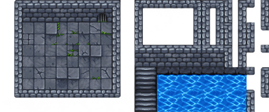
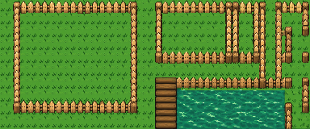
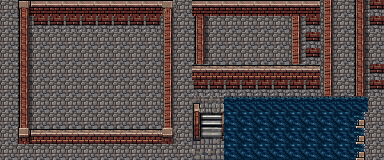
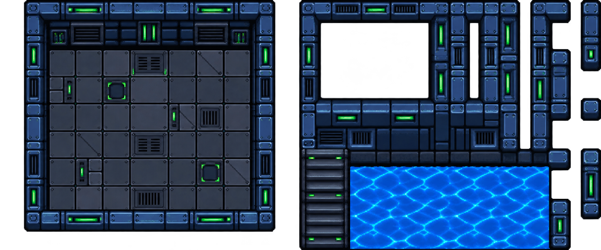

# Scene Sheet 24x10 v1

`scene-sheet-24x10-v1` is a composed 24-column by 10-row environment sheet.
Its exact layout template is codenamed `tileset-layout-wang-mixed`.
At 16x16 pixels per cell, the PNG is 384x160 pixels. It places an interior
room on the left, exterior wall variants at the upper right, a transition or
stairs at the lower middle, and liquid terrain at the lower right.

The first theme, **Retro Dungeon**, keeps gray-blue stone, small green moss
details, dark openings, and stairs, with blue water. The visual reference was
the user-supplied `Tileset_Dungeon.png`; its original creator and license were
not provided. This derived sheet is an art-format example, not a verified
Tiled TSX or a claim that every cell tiles seamlessly.

The second theme, **Retro Forest**, keeps the same Scene Sheet size and grid:

It replaces both wall sections with picket fencing, uses one pixel-identical
16x16 grass tile across clear grass cells in the room and former dark areas,
and keeps a forest pond in the lower right. The composed PNG is accompanied by
a [three-tile basic Figure 8](retro-forest-basic/README.md) and a separate
[limited Wang-ready fence set](retro-forest-wang/README.md), both built and
verified in the live Tiled editor.

The third theme, **Retro Street**, uses brick walls, one repeated cobblestone
ground cell in the room and former dark areas, and dark dirty-blue sewer
water. It keeps the original room, exterior wallset, stairs, and water
footprints on the same 24×10 grid:

Its [source and composition notes](retro-street/README.md),
[three-tile basic Figure 8](retro-street-basic/README.md), and
[limited Wang-ready brick set](retro-street-wang/README.md) are included.

The **Space Tech Robot** theme uses 64x64 cells on the same 24x10 layout,
making a 1536x640 PNG. It retains the interior room at upper left, the
exterior walls and detached support pieces at upper right, the stairs below,
and the coolant at lower right:

Its palette and circuit motifs were inspired by a separate user-supplied
robot screenshot; that image's original creator and license were not provided.
This sheet has no Wang metadata or verified Tiled TSX.
Its [64px companion tileset, Mixed Wang proof, and Figure 8 samples](space-tech-robot/README.md)
are documented separately, along with five additional `future-1` to
`future-5` art variants.

The format contract and validator ship with
[`tiled-ai-create-tileset-png`](../../../skills/tiled-ai-create-tileset-png/SKILL.md).

The [Retro Dungeon basic Figure 8](retro-dungeon-basic/README.md) and
[Retro Dungeon Wang companion](retro-dungeon-wang/README.md) document the
first theme. Each composed 384x160 Scene Sheet itself has no Wang metadata;
the corresponding external TSX carries it.
