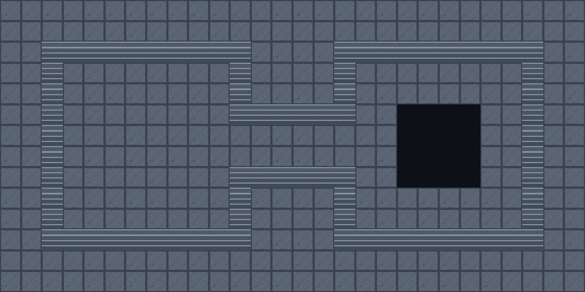

# Retro Dungeon basic Figure 8

This is the **before-autotiling** sample. It uses the same 16×16 Retro Dungeon
companion art as the Wang example, imported as a separate external TSX with
no Wang sets. The map, TSX, and imported PNG are together in [`output`](output/).

- [Open the 28×14 sample map](output/retro-dungeon-figure-8-basic.tmx) with its
  [external tileset](output/retro-dungeon-basic.tsx).
- Local tile **23** is the user-selected striped tile used on all 76 Figure 8
  boundary cells. In the original companion key this art is called stairs;
  this sample uses it as a uniform non-walkable wall.
- Local tile **20** is the walkable stone floor used on the rest of the map.
- Local tile **21** is the near-black, empty-looking tile used for a 4×4 patch
  in the right interior. The patch leaves a walkable route around it.

The live `rpgjs/tiled-ai` editor reported no Wang sets on this TSX. It created
and rendered the map, and `read_region` confirmed the three user-selected tile
IDs, all 76 uniform wall cells, the 16-cell void patch, and an empty Objects
layer before saving. The [Wang companion](../retro-dungeon-wang/README.md) shows the
more complex version after autotiling.

The source style came from the user-supplied dungeon reference; its original
creator and license were not provided.
