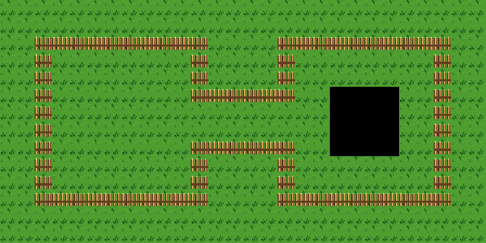

# Retro Forest basic Figure 8

This is the **before-autotiling** sample of the approved Retro Forest theme.
The 28×14 map uses only three local tile IDs from its own 16×16 external TSX,
which has no Wang set. Its TSX and imported PNG are together in [`output`](output/).

- [Open the basic sample map](output/retro-forest-figure-8-basic.tmx) with its
  [external tileset](output/retro-forest-basic.tsx).
- Tile **23** is the uniform picket fence used on all 76 Figure 8 boundary
  cells. It is a top-wall fallback because the sheet has no stronger
  non-directional fence tile.
- Tile **20** is the repeating walkable grass used on the rest of the map.
- Tile **21** is solid black and marks a 4×4 void in the right interior. A
  grass route remains around the patch.

The live `rpgjs/tiled-ai` editor reported no Wang set on this TSX. It created,
rendered, and saved the map. `read_region` confirmed 76 matching fence cells,
376 grass cells, 16 black cells, and an empty Objects layer. The
[Wang companion](../retro-forest-wang/README.md) shows the fence with directional
corners and joins.

The grass and pond cells came from the [approved Scene Sheet](../retro-forest.png),
which was generated from the user-supplied dungeon layout concept. The
reference image's original creator and license were not provided.
