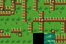
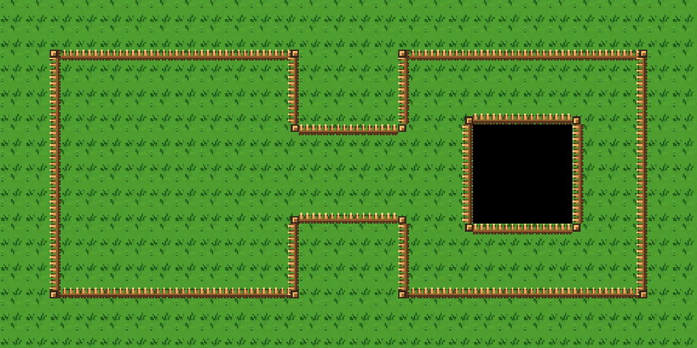

# Retro Forest Wang companion

This 96×64 companion PNG has 24 cells at 16×16 pixels: 21 authored fence
roles, one black void, one pond tile, and one uniform fence tile. It comes
from the approved [384×160 Retro Forest Scene Sheet](../retro-forest.png).
The grass and pond pixels are taken from that sheet; the picket fence masks
were authored for this Figure 8 layout.

- [Open the Wang Figure 8](output/retro-forest-figure-8-wang.tmx) with its
  [external tileset](output/retro-forest-wang.tsx) and imported PNG beside it.
- [Role key](mapping.json) records every local tile ID and its eight-value
  Wang assignment. The [builder](../../../../skills/tiled-ai-create-art/scripts/build_forest_wang_companion.py)
  recreates the PNG and key.
- [Boundary probe](output/retro-forest-wang-probe.tmx) is the live Tiled
  4×4 paint fixture used before the full Figure 8.

The live `rpgjs/tiled-ai` bridge created the `Fenced clearings` mixed Wang set
with one `Walkable grass` color. The probe rendered joined corners and edges.
On the 28×14 sample, Tiled populated all 200 requested Wang cells. A readback
compared every painted local ID with its expected side and diagonal mask and
found no mismatch. The map has 392 grass floor cells, 16 black core cells on
`Walls`, and an empty Objects layer. Grass also fills the entire lower-right
area. The preview is the live Tiled region render cropped to the map area.

This set is **limited Wang-ready** for the tested Figure 8 footprint. The
remaining masks have not been verified for arbitrary corridors or islands.
The pond tile is available for other maps, but this topology sample uses a
uniform walkable floor to show the fence clearly.

The style was derived from the user-supplied dungeon layout concept; its
original creator and license were not provided.
