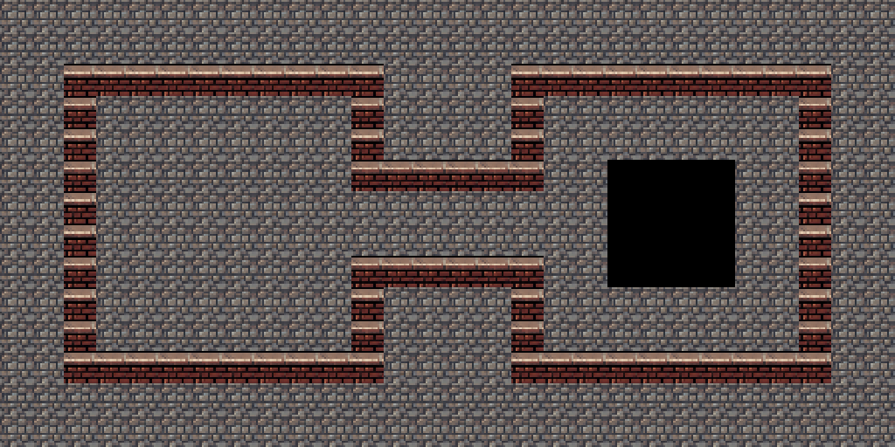

# Retro Street basic Figure 8

This **before-autotiling** 28×14 map uses three local tile IDs from its own
16×16 external TSX, which has no Wang set. The TSX and imported PNG are
together in [`output`](output/).

- [Open the basic sample map](output/retro-street-figure-8-basic-room.tmx) with
  its [external tileset](output/retro-street-basic-room.tsx).
- Tile **23** is the uniform brick top-wall fallback used on all 76 Figure 8
  boundary cells.
- Tile **20** is the repeating walkable cobblestone used across the floor.
- Tile **21** is solid black and marks a 4×4 void in the right interior.

The live `rpgjs/tiled-ai` editor reported no Wang set on this TSX. It created,
rendered, and saved the map. `read_region` confirmed 76 matching brick cells,
376 cobblestone cells, 16 black cells, and an empty Objects layer. The
[Wang companion](../retro-street-wang/README.md) adds directional brick
corners and joins.

The [Street Scene Sheet](../retro-street.png) and its
[source notes](../retro-street/README.md) document the generated art.
