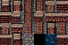

# Retro Street Wang companion

This 96×64 companion PNG has 24 cells at 16×16 pixels: 21 authored brick
wall roles, one black void, one dark dirty-blue sewer tile, and one plain
brick top-wall tile. Its cobblestone, sewer, and full-width brick wall cells
come from the [Retro Street Scene Sheet](../retro-street.png). The directional
roles use the sheet's upper-left room wall and corner art so the sample's left
lobe has the same stone cap and substantial red brick face.

- [Open the corrected Wang Figure 8](output/retro-street-figure-8-wang-corners.tmx) with its
  [external tileset](output/retro-street-wang-corners.tsx) and imported PNG beside
  it.
- [Role key](mapping.json) records every local tile ID and its eight-value
  Wang assignment. The [builder](../../../../skills/tiled-ai-create-tileset-png/scripts/build_street_wang_companion.py)
  recreates the PNG and key.
- The earlier [boundary probe](output/retro-street-wang-room-probe.tmx) tested
  the same Wang masks before this corner-art correction.

The live `rpgjs/tiled-ai` bridge created the `Walled streets` mixed Wang set
with one `Walkable street` color. On the corrected 28×14 sample, Tiled painted
all 200 Wang cells. A readback compared every painted local ID with its
expected side and diagonal mask and found no mismatch. The map has 392
cobblestone floor cells, 16 black core cells on `Walls`, four explicit tiles
on `Wall Joints`, and an empty Objects layer. Cobblestone fills the entire
lower-right area. The preview is the live Tiled region render cropped to the
map area.

The four inner void corners now use the same complete room-corner cells as
their matching outer corners. The bridge joins at cells `(11,5)`, `(16,5)`,
`(11,8)`, and `(16,8)` use matching corner tiles on `Wall Joints`. The
walkable-footprint Wang masks at those cells also occur at ordinary floor or
straight-wall cells, so one Wang assignment cannot select the needed join
art there. The overlay is explicit and separate from the 200 Wang-painted
cells; the [role key](mapping.json) records its tile IDs.

This set is **limited Wang-ready** for the tested Figure 8 footprint. The
remaining masks have not been verified for arbitrary corridors or islands.
The sewer tile is available for other maps; this topology sample uses one
uniform walkable floor so the brick walls stay clear.

The [source notes](../retro-street/README.md) document the generated
concept and composition.
