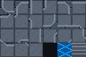
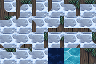
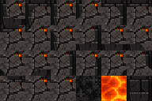
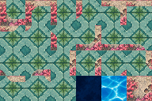

[Back to README.md](../README.md)

# Tiled Wang Examples

Explore ten portable Wang examples. Click a name for its prompt, TMX map, external TSX, source notes, and full-size images. Click a thumbnail for the PNG. Each output directory keeps `level.tmx`, `tiles.tsx`, and `tiles.png` together so the map opens with its referenced art.

| Name | Grid | Tileset PNG | Sample level PNG |
|---|---|---|---|
| [01 Mossy Retro Dungeon](examples/01-mossy-retro-dungeon/README.md) | 16×16 |  |  |
| [02 Fenced Forest Clearing](examples/02-fenced-forest-clearing/README.md) | 16×16 |  |  |
| [03 Rainwashed Brick Street](examples/03-rainwashed-brick-street/README.md) | 16×16 |  |  |
| [04 Stone Courtyard Ruins](examples/04-stone-courtyard-ruins/README.md) | 32×32 |  |  |
| [05 Robotic Coolant Facility](examples/05-robotic-coolant-facility/README.md) | 64×64 |  |  |
| [06 Sunlit Desert Oasis](examples/06-sunlit-desert-oasis/README.md) | 32×32 |  |  |
| [07 Snowbound Pine Village](examples/07-snowbound-pine-village/README.md) | 32×32 |  |  |
| [08 Volcanic Basalt Keep](examples/08-volcanic-basalt-keep/README.md) | 32×32 |  |  |
| [09 Coral Sunken Temple](examples/09-coral-sunken-temple/README.md) | 32×32 |  |  |
| [10 Glowing Mushroom Grove](examples/10-glowing-mushroom-grove/README.md) | 32×32 |  |  |

## Prompts

These are prompts to try with the skills. The source notes in each example explain how its checked-in assets were made.

1. **Mossy Retro Dungeon, 16×16** — `$tiled-ai-create-tileset-png Create a grid-safe mixed Wang tileset at 16x16 with the theme retro pixel art, mossy blue-gray dungeon walls and stone floor; then add the tileset and Wang terrain in Tiled and make a 28x14 Figure 8 sample level with a 4x4 unwalkable core.`
2. **Fenced Forest Clearing, 16×16** — `$tiled-ai-create-tileset-png Create a grid-safe mixed Wang tileset at 16x16 with the theme retro pixel art, grass clearing, picket fence, forest pond; then add the tileset and Wang terrain in Tiled and make a 28x14 Figure 8 sample level with a 4x4 unwalkable core.`
3. **Rainwashed Brick Street, 16×16** — `$tiled-ai-create-tileset-png Create a grid-safe mixed Wang tileset at 16x16 with the theme retro pixel art, red brick walls, cobblestone street, blue sewer; then add the tileset and Wang terrain in Tiled and make a 28x14 Figure 8 sample level with a 4x4 unwalkable core.`
4. **Stone Courtyard Ruins, 32×32** — `$tiled-ai-create-tileset-png Create a grid-safe mixed Wang tileset at 32x32 with the theme warm stone courtyard tiles, dark ruined boundary, restrained pixel art; then add the tileset and Wang terrain in Tiled and make a 28x14 Figure 8 sample level with a 4x4 unwalkable core.`
5. **Robotic Coolant Facility, 64×64** — `$tiled-ai-create-tileset-png Create a grid-safe mixed Wang tileset at 64x64 with the theme robotic steel facility, blue coolant, dark panel walls; then add the tileset and Wang terrain in Tiled and make a 28x14 Figure 8 sample level with a 4x4 unwalkable core.`
6. **Sunlit Desert Oasis, 32×32** — `$tiled-ai-create-tileset-png Create a grid-safe mixed Wang tileset at 32x32 with the theme sunlit sandstone oasis, carved walls, teal water, pixel art; then add the tileset and Wang terrain in Tiled and make a 28x14 Figure 8 sample level with a 4x4 unwalkable core.`
7. **Snowbound Pine Village, 32×32** — `$tiled-ai-create-tileset-png Create a grid-safe mixed Wang tileset at 32x32 with the theme snowy pine village, timber walls, frozen pond, pixel art; then add the tileset and Wang terrain in Tiled and make a 28x14 Figure 8 sample level with a 4x4 unwalkable core.`
8. **Volcanic Basalt Keep, 32×32** — `$tiled-ai-create-tileset-png Create a grid-safe mixed Wang tileset at 32x32 with the theme volcanic basalt keep, ember cracks, lava, pixel art; then add the tileset and Wang terrain in Tiled and make a 28x14 Figure 8 sample level with a 4x4 unwalkable core.`
9. **Coral Sunken Temple, 32×32** — `$tiled-ai-create-tileset-png Create a grid-safe mixed Wang tileset at 32x32 with the theme sunken coral temple, sea-green mosaic, seawater, pixel art; then add the tileset and Wang terrain in Tiled and make a 28x14 Figure 8 sample level with a 4x4 unwalkable core.`
10. **Glowing Mushroom Grove, 32×32** — `$tiled-ai-create-tileset-png Create a grid-safe mixed Wang tileset at 32x32 with the theme glowing mushroom grove, violet moss, roots, luminous pool; then add the tileset and Wang terrain in Tiled and make a 28x14 Figure 8 sample level with a 4x4 unwalkable core.`

The gallery uses the Figure 8 footprint only. The five new 32×32 companions were assembled from original generated material sheets; their maps were opened in Tiled and their 21 mixed Wang assignments inspected. This does not establish support for arbitrary terrain shapes.
