[Back to README.md](../README.md)

# Tiled Wang Examples

The numbered examples use the `tileset-layout-wang-mixed` scene layout. Every tileset thumbnail is a 24×10 scene sheet; each example also includes a separate Mixed Wang companion, external TSX, and portable Figure 8 TMX map. The 24×10 scene sheet is composed artwork and has no Wang assignments itself. Open the map using the companion assets kept beside it.

| Name | Grid | Layout | Tileset PNG | Sample level PNG |
|---|---|---|---|---|
| [Mossy Retro Dungeon](examples/01-mossy-retro-dungeon/README.md) | 16×16 | `tileset-layout-wang-mixed` | <a href="examples/01-mossy-retro-dungeon/output/scene-sheet.png">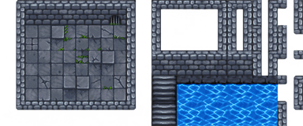</a> | <a href="examples/01-mossy-retro-dungeon/output/preview.png">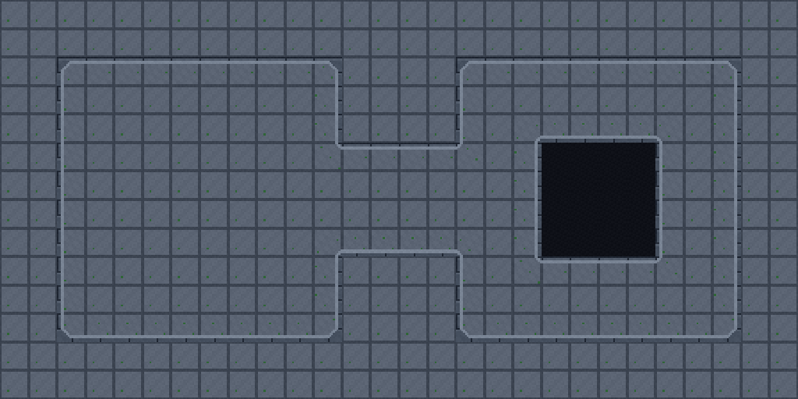</a> |
| [Fenced Forest Clearing](examples/02-fenced-forest-clearing/README.md) | 16×16 | `tileset-layout-wang-mixed` |  |  |
| [Rainwashed Brick Street](examples/03-rainwashed-brick-street/README.md) | 16×16 | `tileset-layout-wang-mixed` | <a href="examples/03-rainwashed-brick-street/output/scene-sheet.png">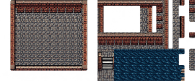</a> |  |
| [Painted Moss River](examples/04-painted-moss-river/README.md) | 64×64 | `tileset-layout-wang-mixed` | <a href="examples/04-painted-moss-river/output/scene-sheet.png">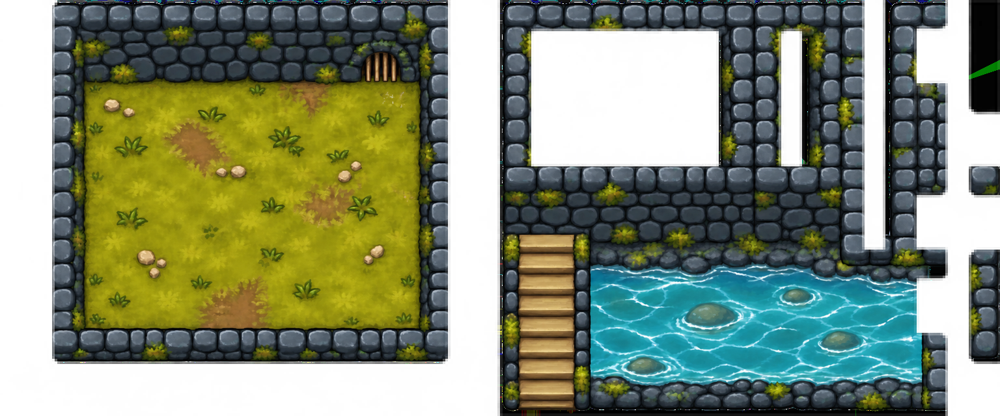</a> | <a href="examples/04-painted-moss-river/output/preview.png">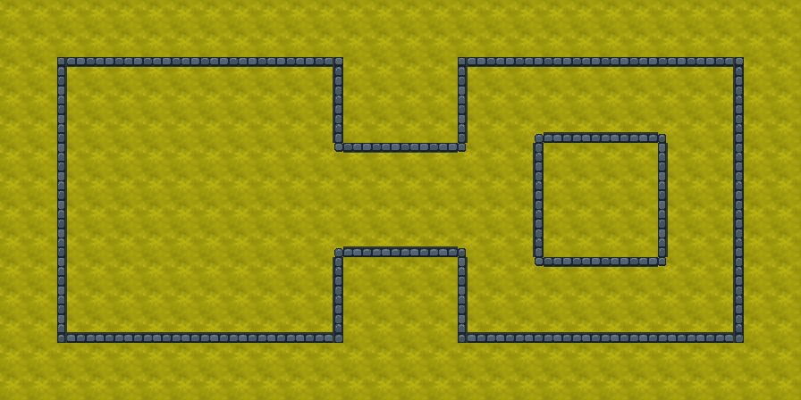</a> |
| [Stone Courtyard Ruins](examples/04-stone-courtyard-ruins/README.md) | 32×32 | `tileset-layout-wang-mixed` |  |  |
| [Robotic Coolant Facility](examples/05-robotic-coolant-facility/README.md) | 64×64 | `tileset-layout-wang-mixed` |  |  |
| [Sunlit Desert Oasis](examples/06-sunlit-desert-oasis/README.md) | 32×32 | `tileset-layout-wang-mixed` | <a href="examples/06-sunlit-desert-oasis/output/scene-sheet.png">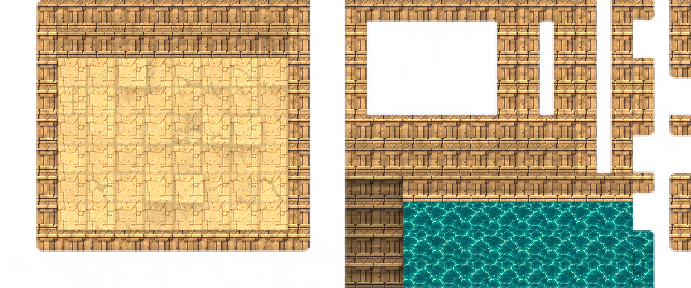</a> |  |
| [Snowbound Pine Village](examples/07-snowbound-pine-village/README.md) | 32×32 | `tileset-layout-wang-mixed` | <a href="examples/07-snowbound-pine-village/output/scene-sheet.png">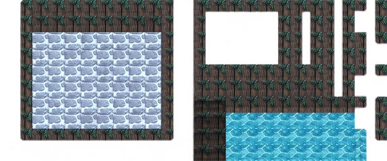</a> | <a href="examples/07-snowbound-pine-village/output/preview.png">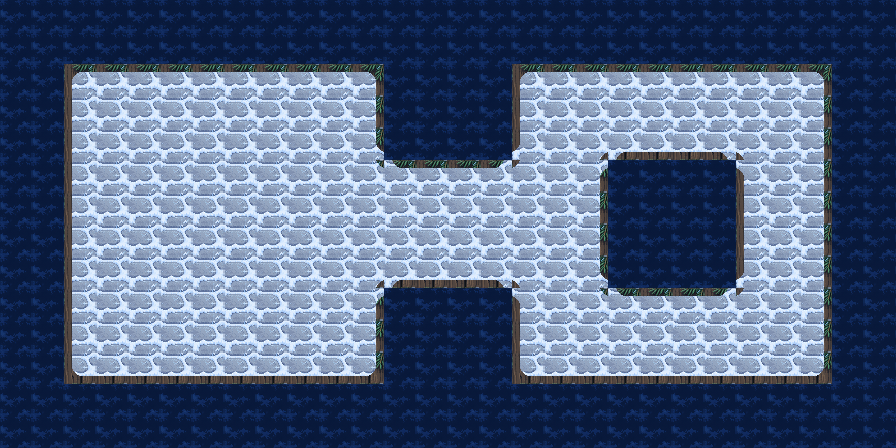</a> |
| [Volcanic Basalt Keep](examples/08-volcanic-basalt-keep/README.md) | 32×32 | `tileset-layout-wang-mixed` | <a href="examples/08-volcanic-basalt-keep/output/scene-sheet.png">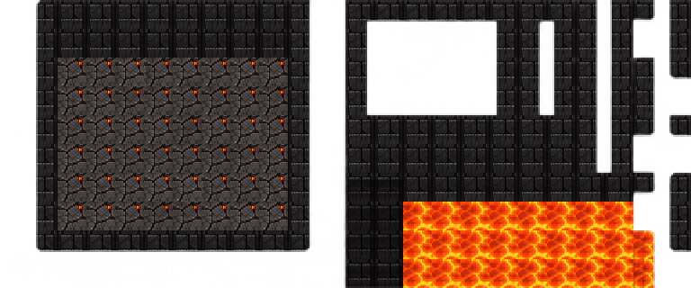</a> | <a href="examples/08-volcanic-basalt-keep/output/preview.png">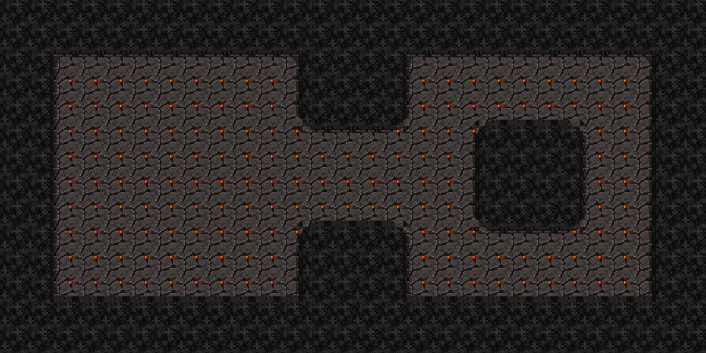</a> |
| [Coral Sunken Temple](examples/09-coral-sunken-temple/README.md) | 32×32 | `tileset-layout-wang-mixed` |  |  |
| [Glowing Mushroom Grove](examples/10-glowing-mushroom-grove/README.md) | 32×32 | `tileset-layout-wang-mixed` | <a href="examples/10-glowing-mushroom-grove/output/tiles.png">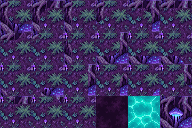</a> | <a href="examples/10-glowing-mushroom-grove/output/preview.png">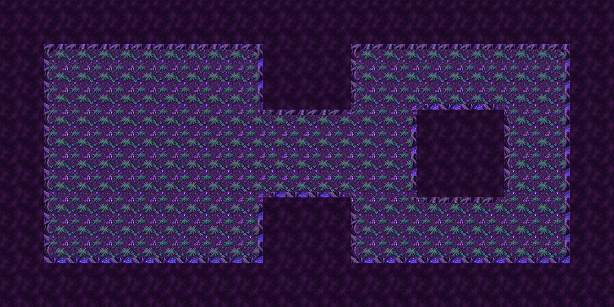</a> |
| [Indigo Crystal Dungeon](examples/10-indigo-crystal-dungeon/README.md) | 64×64 | `tileset-layout-wang-mixed` | <a href="examples/10-indigo-crystal-dungeon/output/scene-sheet.png">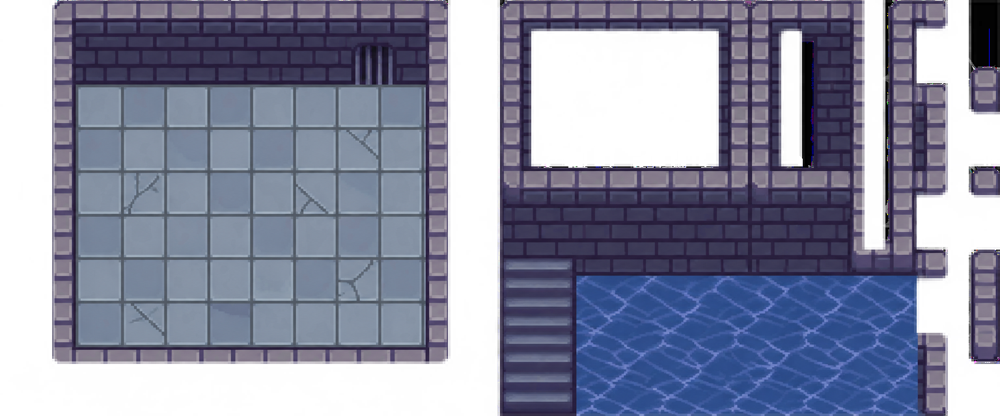</a> | <a href="examples/10-indigo-crystal-dungeon/output/preview.png">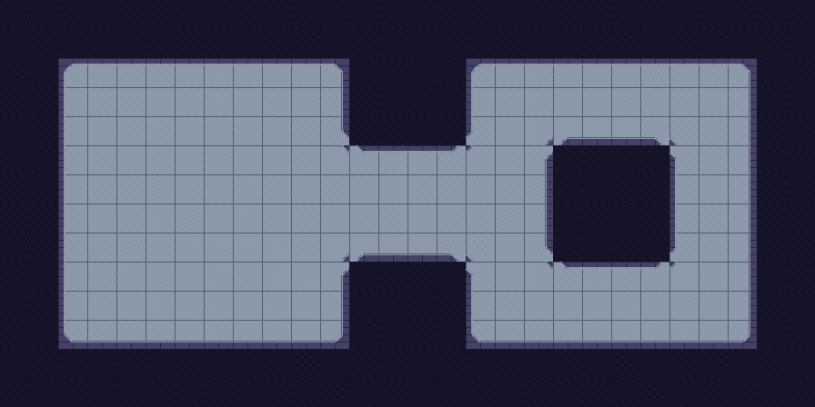</a> |

## Prompts

Each example page contains its full prompt and source notes. The layout reference is included as [layout-reference.png](examples/layout-reference.png).

## Verification scope

The 16×16 Retro Dungeon, Forest, and Street Wang sources and the 64×64 Painted Moss River and Indigo Dungeon sources had live Figure 8 terrain checks in their original sessions. The 64×64 Robot Wang source had a live check in its original session. The 32×32 companion maps were assembled from generated swatches and inspected in Tiled; they were not live terrain-painted. Each packaged map was generated or copied with local TSX and PNG references. A scene sheet alone is not a Wang tileset.
