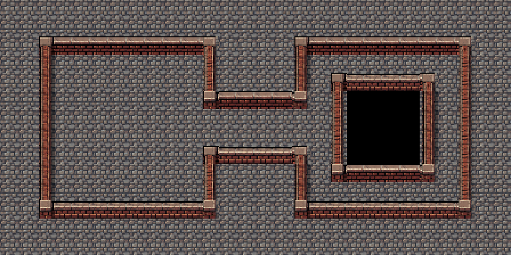

# Rainwashed Brick Street

Grid: **16x16**. Wang type: **mixed**. Sample: **28x14 Figure 8**.

## Try this prompt

```text
$tiled-ai-create-tileset-png Create a grid-safe mixed Wang tileset at 16x16 with the theme retro pixel art, red brick walls, cobblestone street, blue sewer; then add the tileset and Wang terrain in Tiled and make a 28x14 Figure 8 sample level with a 4x4 unwalkable core.
```

## Wang results

| Tileset PNG | Sample level PNG |
|---|---|
|  |  |

[Open the Tiled map](output/level.tmx) with its [external tileset](output/tiles.tsx) and [local tile image](output/tiles.png). Keep all three output files together.

Adapted from the existing [Retro Street Wang companion](../../art-formats/scene-sheet-24x10/retro-street-wang/README.md). The source notes explain its generated concept and composition; the corrected source Figure 8 was previously painted and checked in Tiled.
The mixed Wang assignments cover the 21 masks used by this Figure 8 footprint. The packaged map was opened in Tiled and its tileset and assignments were inspected. Other terrain shapes have not been paint-tested here.
