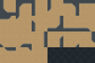

# Stone Courtyard Ruins

Grid: **32x32**. Wang type: **mixed**. Sample: **28x14 Figure 8**.

## Try this prompt

```text
$tiled-ai-create-tileset-png Create a grid-safe mixed Wang tileset at 32x32 with the theme warm stone courtyard tiles, dark ruined boundary, restrained pixel art; then add the tileset and Wang terrain in Tiled and make a 28x14 Figure 8 sample level with a 4x4 unwalkable core.
```

## Wang results

| Tileset PNG | Sample level PNG |
|---|---|
|  |  |

[Open the Tiled map](output/level.tmx) with its [external tileset](output/tiles.tsx) and [local tile image](output/tiles.png). Keep all three output files together.

Adapted from a local Figure 8 Autotiling fixture built by a repository script. That source was a portable fixture, not a live terrain-painting result.
The mixed Wang assignments cover the 21 masks used by this Figure 8 footprint. The packaged map was opened in Tiled and its tileset and assignments were inspected. Other terrain shapes have not been paint-tested here.
