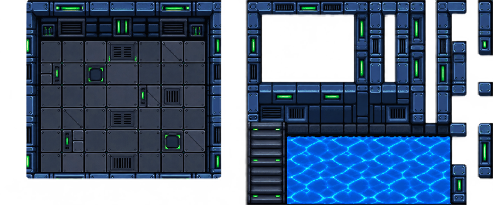

# Robotic Coolant Facility

Grid: **64×64**. Layout: **`tileset-layout-wang-mixed`**. Wang type: **mixed**.

## Try this prompt

```text
$tiled-ai-create-art Create a 64x64 scene sheet in layout tileset-layout-wang-mixed with the theme robotic steel coolant facility. Keep the exact 24x10 reference silhouette, interior room, exterior assembly, detached supports, stairs, liquid, and transparent gaps. Then make a separate Mixed Wang companion and a 28x14 Figure 8 sample level with a 4x4 unwalkable core.
```

## Wang results

| 24×10 scene sheet PNG | Sample level PNG |
|---|---|
|  |  |

The [Wang companion PNG](output/tiles.png), [external TSX](output/tiles.tsx), and [TMX map](output/level.tmx) stay together in `output/`. Open the TMX in Tiled with all three files present. The scene sheet follows the 24×10 composition; the companion contains the actual Wang assignments.

[Original scene source](input/scene-source.png) is included. Existing Space Tech Robot scene and Wang companion from the open robot chat. A user-supplied robot screenshot inspired its palette; original creator and license were not provided.

The Mixed Wang companion includes the masks required for this Figure 8. This example does not establish arbitrary shape support.
