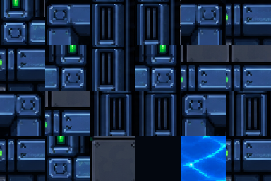
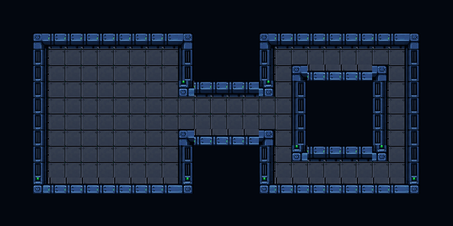

# Robotic Coolant Facility

Grid: **64x64**. Wang type: **mixed**. Sample: **28x14 Figure 8**.

## Try this prompt

```text
$tiled-ai-create-tileset-png Create a grid-safe mixed Wang tileset at 64x64 with the theme robotic steel facility, blue coolant, dark panel walls; then add the tileset and Wang terrain in Tiled and make a 28x14 Figure 8 sample level with a 4x4 unwalkable core.
```

## Wang results

| Tileset PNG | Sample level PNG |
|---|---|
|  |  |

[Open the Tiled map](output/level.tmx) with its [external tileset](output/tiles.tsx) and [local tile image](output/tiles.png). Keep all three output files together.

Uses an existing Space Tech Robot scene sheet and its Wang companion. A user-supplied robot screenshot inspired its palette; its original creator and license were not provided. The compact map and preview were assembled by this gallery builder.
The mixed Wang assignments cover the 21 masks used by this Figure 8 footprint. The packaged map was opened in Tiled and its tileset and assignments were inspected. Other terrain shapes have not been paint-tested here.
