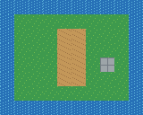

# Starter Map

A portable 10 × 8 orthogonal map with a grass island, water border, path, one stone tile, and a point object named Player Spawn.

- [Open the TMX map](output/starter-map.tmx) in Tiled.
- The map references the external [TSX tileset](output/tiles.tsx), which references [tiles.png](output/tiles.png). Keep all three files together.
- [Prompt](input/prompt.txt) records the intended example. The [builder](../../../scripts/build_starter_example.py) generates every output with Python's standard library.

This example verifies the file structure and packaging. It was generated without an editor session; it does not claim that the Tiled AI bridge authored it.
